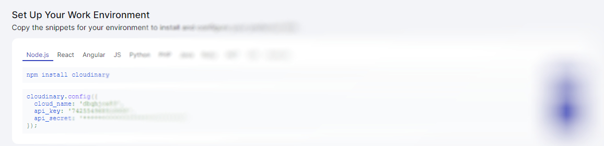

# Installation to run this on your local system


# Frontend installation making a build
This project was bootstrapped with [Create React App](https://github.com/facebook/create-react-app).
Please ensure that you have already installed NodeJS in your system. If not, here is the [Link](https://nodejs.org/en/download).

Make a file of .env in the same directory of src and public folder, and please add these five credentials you can access.
- REACT_APP_ADMIN_ID : ID for ADMIN.
- REACT_APP_ADMIN_PASSWORD : Password for ADMIN.
  
## Available Scripts

Go to the project directory of the frontend using "cd frontend " and ensure all the packages are installed hence use the following:
### `npm install.`
To install all the frontend packages in your system

In the project directory, you can run the following:
### `npm start.`

It runs the app in development mode.\
Open [http://localhost:3000](http://localhost:3000) to view it in your browser.
But this will not connect to the backend, but one can run it to check errors in the frontend program. 

The page will reload when you make changes.\
You may also see any lint errors in the console.

### `npm run build.`
Builds the app for production to the `build` folder.\
It correctly bundles React in production mode and optimises the build for the best performance.

The build is minified, and the filenames include the hashes.\
Your app is ready to be deployed!

Now backend can read the build file to get to the frontend. 

See the section about [deployment](https://facebook.github.io/create-react-app/docs/deployment) for more information.


# Backend installation making your accounts.

For the backend of this project, we have used `Node.js` and `Express.js.`

As a database in this project, MySQL is used. Please make sure you have set up MySQL in your system. If not, here is the [Link](https://dev.mysql.com/downloads/installer/)

For storing Images in my backend, we have used Cloudinary. It is a cloud-based media management platform that provides comprehensive tools and services for managing, manipulating, optimising, and delivering media files, including images, videos, and documents. We have used it to store pictures of reviews in our backend.

Sign In and make an account in Cloudinary. When Logged In, go to Getting Started, where you will see your credentials like this:



## Setting Up accounts
Make a file of .env in the same directory of server.js, and please add these five credentials you can access.

- MYSQL_DATABASE: Name of the database where your table of reviews is made and stored.
- MYSQL_PASSWORD: Password of your MySQL that you have set up in your localhost:3000.
- CLOUDINARY_CLOUD_NAME: Name from your Cloudinary account - refer to the above image.
- CLOUDINARY_API_KEY: Key from your Cloudinary account - refer to the above image.
- CLOUDINARY_API_SECRET: Api-secret from your Cloudinary account - refer to the above image.

After this is set, connect your database and make a table of name "reviews" there. 
You can use this command in your MySQL WorkBench to make a table. 

```
use MYSQL_DATABASE(Name of the database)
CREATE TABLE reviews (
  id INT PRIMARY KEY AUTO_INCREMENT,
  name VARCHAR(100) NOT NULL,
  designation VARCHAR(100) NOT NULL,
  email VARCHAR(100) NOT NULL,
  comment VARCHAR(500) NOT NULL,
  stars INT NOT NULL,
  image VARCHAR(255),
  confirmed TINYINT(1) DEFAULT 0
);
```

## Available Scripts

Go to the project directory of the backend using "cd backend " and ensure all the packages are installed hence use the following:
### `npm install.`
To install all the backend packages in your system in packages.json. 

### `node server.js .`
To run your backend to connect with localhost:3000. Now the project is up and running. You can get what errors are there in the backend part of your project.
Go to https://localhost:3000

Thank you.


